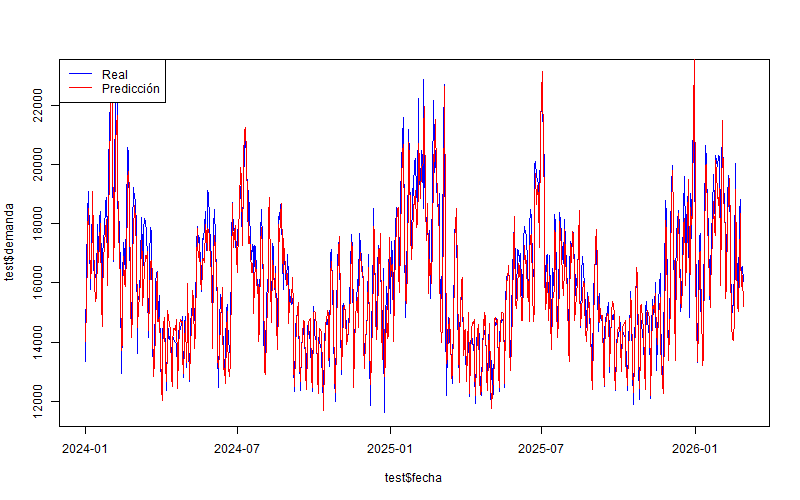

# Forecast de Demanda Eléctrica

Proyecto de análisis y modelado de series temporales aplicado a la demanda eléctrica diaria, utilizando datos históricos y variables explicativas como temperatura y tipo de día.

---

## Objetivo

El objetivo de este proyecto es desarrollar un modelo que permita explicar y predecir la demanda eléctrica diaria, identificando patrones de estacionalidad y variables clave que impactan en el consumo.

Este tipo de modelos es fundamental en el sector energético para:
- Planificación de generación
- Optimización de costos
- Estabilidad del sistema eléctrico

---

## Dataset

- Fuente: Base histórica de demanda eléctrica (2017–2026)
- Frecuencia: diaria
- Variables utilizadas:
  - Demanda total (MW)
  - Temperatura media (GBA)
  - Tipo de día (hábil / no hábil)
  - Fecha

---

## Metodología

El proyecto se estructura en tres etapas principales:

### 1. Data Cleaning
- Selección de variables relevantes
- Conversión de fechas
- Generación de nuevas variables:
  - Temperatura² (relación no lineal)
  - Indicador de día hábil
  - Lag de demanda (t-1)

### 2. Exploratory Data Analysis (EDA)
- Análisis de serie temporal
- Estacionalidad semanal
- Estacionalidad mensual
- Relación demanda vs temperatura

Hallazgo clave:
Se observa una relación en forma de U entre demanda y temperatura, consistente con mayor consumo en extremos térmicos (frío/calor).

### 3. Modelado

Se entrenaron dos modelos de regresión lineal:

#### Modelo 1
Variables:
- Temperatura
- Temperatura²
- Día hábil

#### Modelo 2 (mejorado)
Se incorpora:
- Lag de demanda (t-1)

---

## 📈 Resultados

| Modelo | RMSE | MAE |
|------|------|------|
| Modelo base | ~1244 | ~983 |
| Modelo con lag | ~752 | ~582 |

Insight:
La incorporación del lag mejora significativamente la capacidad predictiva del modelo, capturando la inercia temporal de la demanda.

---

## Visualización

### Demanda real vs predicha

---

## Conclusiones

- La demanda eléctrica presenta:
  - Fuerte estacionalidad semanal
  - Comportamiento no lineal respecto a la temperatura
- Variables climáticas + comportamiento pasado explican gran parte del consumo
- Modelos simples pueden lograr buen desempeño si las features están bien definidas

---

## Tecnologías utilizadas

- R
- dplyr
- ggplot2
- tsibble
- Metrics

---

## Estructura del proyecto

forecast-demanda-energia/

│

├── 01_data/

│   ├── raw/

│   └── processed/

│

├── 02_scripts/

│   ├── 01_cleaning.R

│   ├── 02_eda.R

│   ├── 03_modeling.R

│   └── run_all.R

│

├── outputs/

│   ├── plots/

│   └── results/

│

└── README.md

Cómo correr el proyecto:

1. Clonar el repositorio:
   
   git clone https://github.com/rriquelme-dev/forecast-demanda-energia.git

3. Abrir en RStudio

4. Ejecutar:
   
   source("02_scripts/run_all.R")

*******************************************************************************************************************************************

---

## Próximos pasos

- Incorporar modelos de series temporales (ARIMA / Prophet)
- Evaluar modelos de machine learning
- Incluir más variables explicativas (económicas, consumo industrial, etc.)

---

## Autor

**Ramiro Riquelme**

Proyecto desarrollado como parte de portfolio en Data Science orientado al sector energético.

